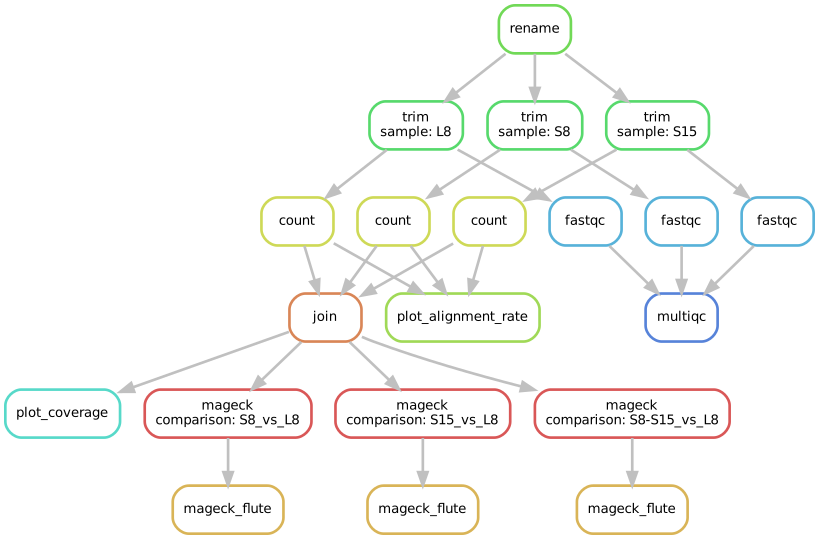
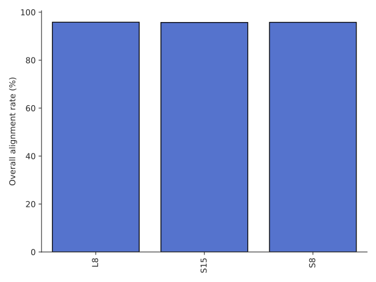
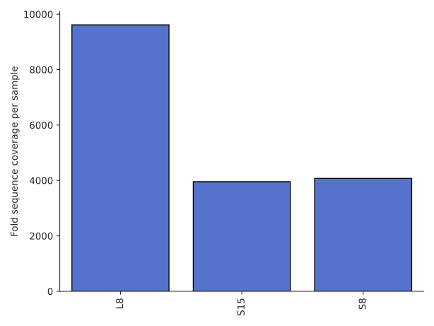
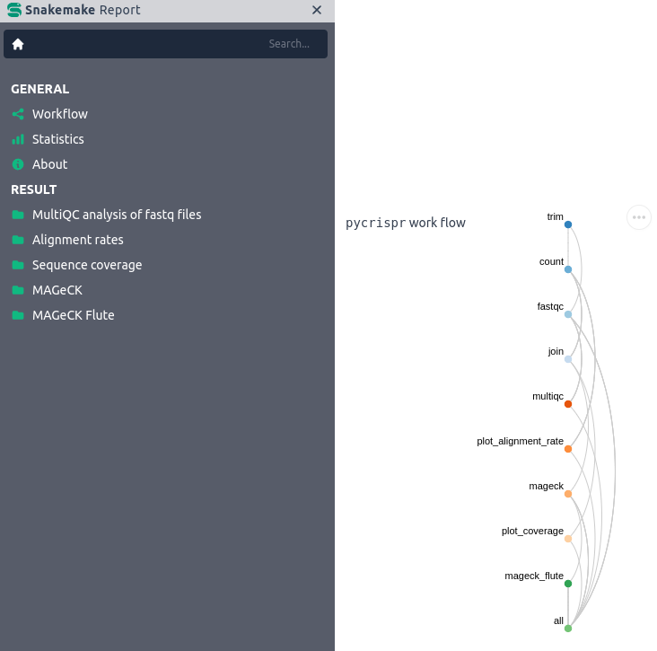

User guide
************

All options
-------------

.. click:: pycrispr.scripts.pycrispr:analysis
   :prog: pycrispr
   :nested: full

Getting started with ``pycrispr``
------------------------------------
``pycrispr`` requires a YAML file (experiment.yaml) that contains information of the experiment, and available CRISPR sgRNA libraries:

.. code-block:: yaml

   rename: #rename to .fq.gz
      L8_S1_L001_R1_001.fastq.gz: L8.fq.gz
      S8_S3_L001_R1_001.fastq.gz: S8.fq.gz
      S15_S4_L001_R1_001.fastq.gz: S15.fq.gz
   library: kinase
   lib_info:
      kinase:
         index: /home/user/Documents/references/index/hisat2/dub-only/kinase.index
         fasta: /home/user/Documents/references/fasta/Human/kinase/kinase.fasta
         sg_length: 20 #length of (shortest) gRNAs in library
         species: hsa #human,hsa;mouse,mmu 
      bassik:
         index: /home/user/Documents/references/index/hisat2/bassik/bassik-index
         fasta: /home/user/Documents/references/fasta/Human/Bassik-library/bassik_lib.fasta
         sg_length: 17
         species: hsa
   mismatch: 0 #mismatches allowed during alignment
   left_trim: 0 #number of nulceotides to trim on 5' end of reads
   stats: 
      type: mageck
      comparisons: #test vs control
            1: S8_vs_L8 #sample names are file names without extension
            2: S15_vs_L8
            3: S8,S15_vs_L8 #samples can be pooled
   resources:
      account: JNATHAN-SL3-CPU
      partition: cclake
      max_jobs: 100 #maximum number of parallel jobs
      short:
         cpu: 1
         time: 15 # in minutes
      trim:
         cpu: 4
         time: 60
      fastqc:
         cpu: 4
         time: 60
      count:
         cpu: 8
         time: 120
      mageck:
         cpu: 1
         time: 60

.. note:: You can delete the rename section if you do not need to rename your files, but please keep in mind that the sample names will be taken from the read files names by removing the file extension. Also, the *comparisons* in the *stats* section should match this.

Preparing CRISPR-Cas9 screen data
------------------------------------
Before running ``pycrispr`` an analysis directory has to be created (can be any name or location), and should contain a sub-directory called *reads*. This sub-directory contains all the fastq files of your CRISPR-Cas9 screen experiment::

   analysis_dir
   ├── reads
   | 	├── L8_S1_L001_R1_001.fastq.gz
   | 	├── S8_S3_L001_R1_001.fastq.gz
   | 	└── S15_S4_L001_R1_001.fastq.gz
   └── experiment.yaml 

.. important:: Please note that ``pycrispr`` only accepts single-end NGS data, so if your data was sequenced in a paired-end fashion, only include the mate that contains the sgRNA sequence information (most commonly read 1). It also assumes that the first nucleotide sequenced is the first nulceotide of the sgRNA sequence, but the first *n* nucleotides can be skipped by setting `left_trim` to *n* in `experiment.yaml` if this is different.

Initiating the pipeline
------------------------------------
To start the analysis, run:

.. code-block:: console

   $ pycrispr analysis -t 24

This will first rename the files according to *experiment.yaml*, use a total of 24 CPU threads, select the *dub-only* sgRNA library, and use MAGeCK for pair-wise comparisons specified in *experiment.yaml*. 

Output files
------------------------------------

Multiple output files will be generated::

   analysis_dir
   ├── count
   |   ├── alignment-rates.pdf
   |   ├── counts-aggregated.tsv
   |   ├── L8.guidecounts.txt
   |   ├── S15.guidecounts.txt
   |   ├── S8.guidecounts.txt
   |   └── sequence-coverage.pdf
   ├── envs
   |   ├── count.yaml
   |   ├── flute.yaml
   |   ├── join.yaml
   |   ├── mageck.yaml
   |   └── trim.yaml
   ├── logs
   |   ├── count
   |   ├── fastqc
   |   ├── mageck
   |   ├── multiqc
   |   └── trim
   ├── mageck
   ├── mageck_flute
   ├── qc
   ├── reads
   | 	├── L8.fq.gz
   | 	├── S8.fq.gz
   | 	└── S15.fq.gz
   ├── scripts
   |   └── flute.R
   ├── dag.pdf
   ├── experiment.yaml
   ├── snakefile
   └── utils.py

``pycrispr`` will first create a Directed acyclic graph (DAG) for the current workflow.

   Directed acyclic graph (DAG) for workflow

Graphs showing the alignment rates and the fold sequence coverage can be found in the *count* directory.

   Alignment rates for each sample

   Fold sequence coverage for each sample (number of aligned reads divided by number of gRNAs in library)

Report
------------------------------------

After the analysis has finished, an HTML report can be generated:

.. code-block:: console

   $ pycrispr report

This report will be located in the analysis directory (pycrispr-report.html).

   `snakemake` HTML report
   