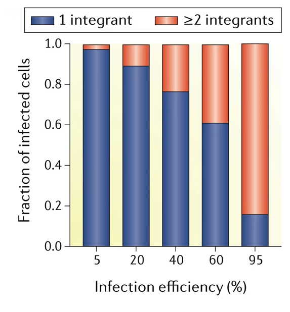
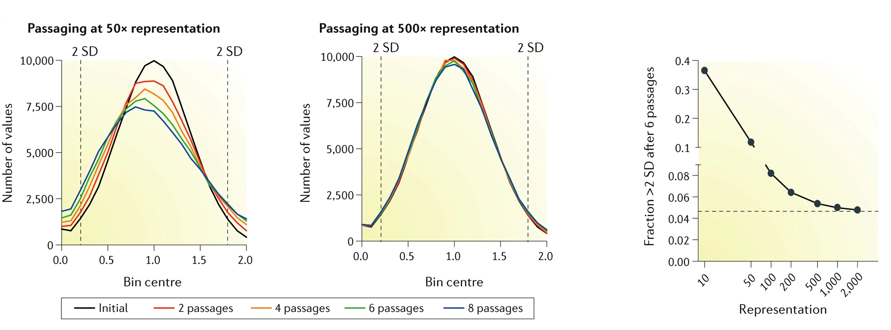

This page will a brief summary of considerations for CRISPR-Cas9 screen experimental design. Please refer to Hanna and Doench (2020) and Doench (2018) for more details (see references below).

Model system
=============

* Choose a suitable model system (primary cells, organoids, cell lines, etc.)
    
    * Primary cells/organoids are more physiologically relevant, but more difficult to use at scale

* Optimise drug concentration for relevant selectable markers

    * Time to kill cells and concentrations are cell line dependent

* When using a two-vector system: 

    * Confirm Cas9 expression/activity in (poly)clonal populations:

        * Polyclonal Cas9 populations may have a range of Cas9 expression levels, which may affect the efficiency of the screen, but will also prevent any stochastic effects when using clones

        * The advantage of using Cas9 clones is that there will be less drift in Cas9 expression levels over time, but the disadvantage is that there may be stochastic effects due to the random integration of the Cas9 vector. Therefore, it is recommended to use multiple Cas9 clones

sgRNA library selection
========================

* Choose the most up-to-date library:

    * Genome anotations are constantly being updated, so older libraries, such as GeCKO v2, may not be as accurate as newer libraries, due to gene annotation drift (e.g. a gene formerly annotated as a protein-coding gene may now be annotated as a pseudogene)

    * Newer libraries might have also been designed using more up-to-date sgRNA design rules, which may improve the performance of the library and reduce off-target effects, such as Michlits et al. (2020).

* Ensure that the selection marker is compatible with your model system

    * For example, if you are using a cell line that is resistant to puromycin, then you should not use a library that uses puromycin as a selection marker

* Identify potential positive sgRNA controls that can be used to assess the performance of the library and make sure that they are included in the library

sgRNA library transduction and representation
==============================================

* Ensure that the multiplicity of infection (MOI) is low enough to ensure that each cell receives only one sgRNA:

    * If the MOI is too high, then some cells will receive more than one sgRNA

    * An MOI of < 0.4 ensures that at least 80% of cells receive only one sgRNA (see figure below)

   Effect of infection efficiency (MOI x100) on fraction of infected cells (adapted from Doench (2018))
    
* During the entire course of the experiment maintain sufficient representation of the sgRNA library:

    * 200-500x coverage is recommended (see figures below)

    
    Modeling of continued passaging of cells with varying levels of library representation (adapted from Doench (2018))

    * For example, to establish 500x representation, one should infect 125 million cells at MOI 0.4 when using a library with 100,000 sgRNAs. In order to maintain this level of representation, 50 million cells should be used for each subsequent passage and DNA isolation/sequencing step

    * It is recommended to harvest replicate samples at each time point, as this will allow for the analysis of technical replicates, but also serve as backups in case of sample prep failure (e.g. during DNA isolation, sequencing, etc.)

Sample comparisons
===================

When comparing two conditions (e.g. genotype or treatment), sometimes one condition affects the proliferation rate of the cell model. It is important to then compare these conditions at a time point where they have the same number of cumulative population doublings.

Cumulative population doublings (CPD) can be calculated as follows:

.. math::
    \Large{\displaystyle\sum_{i=p}^n CPD_i = \frac{\ln \frac{N_1}{N_0}}{\ln 2} + \frac{\ln \frac{N_2}{N_0}}{\ln 2} + ... + \frac{\ln \frac{N_p}{N_0}}{\ln 2}}

where:

* :math:`n` is the total passage number
* :math:`p` is the passage number
* :math:`N_p` is the number of cells at the end of passage :math:`p` 
* :math:`N_0` is the number of cells seeded at the beginning of passage :math:`p`.

Protocols
==========

Below are protocols that describe the steps involved in a CRISPR-Cas9 screen (Based on Wit et al. (2023)):

(NEEDS TO BE UPDATED!):

#. Creation of *Cas9* expressing cell line :download:`(Download) <cas9_transduction.pdf>`
#. *Cas9* activity assay using flowcytometry :download:`(Download) <cas9_activity_flow.pdf>`
#. sgRNA library virus production and tritrations :download:`(Download) <virus_production.pdf>`
#. CRISPR-Cas9 screening :download:`(Download) <CRISPR_screening.pdf>`

References
===========

#. Hanna, R. E. & Doench, J. G. Design and analysis of CRISPR-Cas experiments. *Nat. Biotechnol.* 38, 813-823 (2020).
#. Doench, J. G. Am I ready for CRISPR? A user's guide to genetic screens. *Nat. Rev. Genet.* 19, 67-80 (2018).
#. Michlits, G. et al. Multilayered VBC Score Predicts sgRNAs that Efficiently Generate Loss-of-Function Alleles. *Nat. Methods* 17, 708-716 (2020).
#. Wit, N. et al. A histone deacetylase 3 and mitochondrial complex I axis regulates toxic formaldehyde production. *Science Adv.* 9 (20), eadg2235 (2023)

